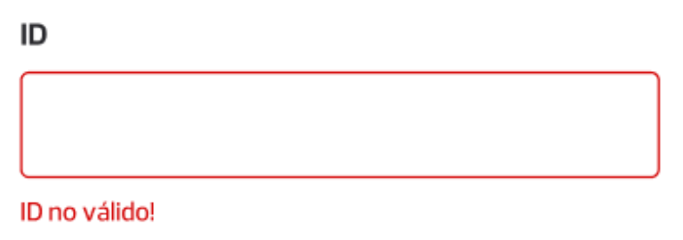
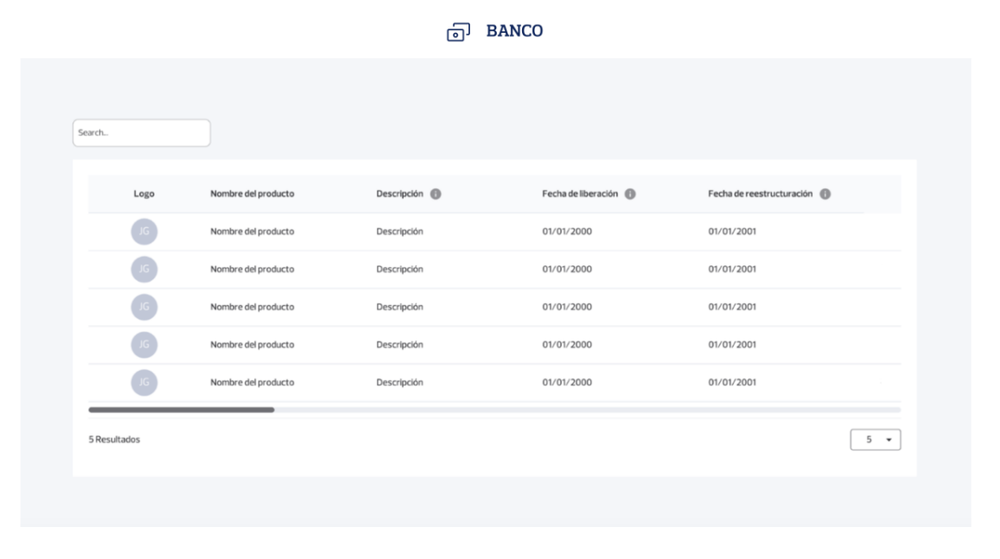
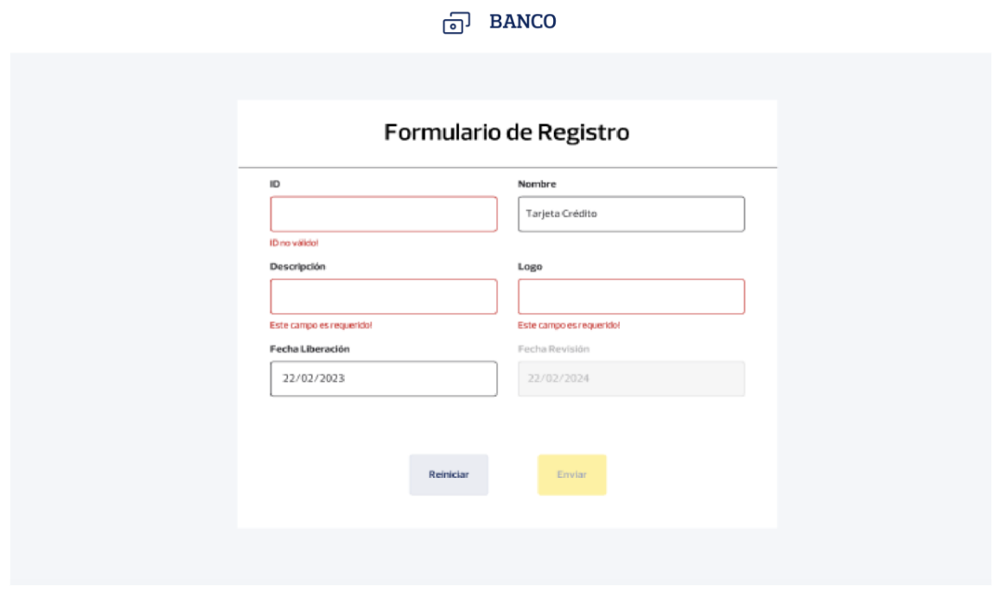
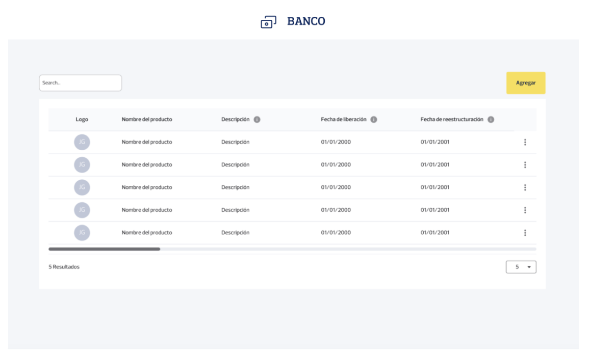
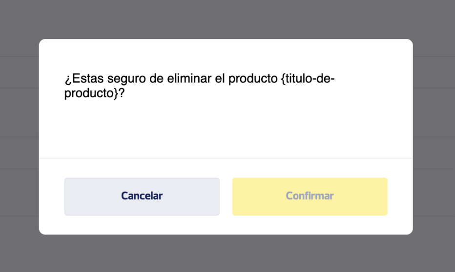

# Prueba Técnica
## Frontend – React (2024)

**Indicaciones generales**

- Aplique todas las buenas prácticas, clean code, SOLID (se tomará en cuenta este punto para la calificación).
- Se debe realizar el UI Develoment (Maquetación) sin usar frameworks de estilos o componentes prefabricados.
- Se debe manejar excepciones y mostrar mensajes de errores visuales.
- Se debe realizar pruebas unitarias y contar con un mínimo de 70% coverage.
- Posterior a la entrega de este ejercicio, se estará agendando una entrevista técnica donde el candidato deberá defender la solución planteada.

`Nota`: Los servicios necesarios a consumir para este proyecto son locales. Más adelante se detallará la manera de hacerlo.

## Herramientas y tecnologías utilizadas

- React 18 o superior
- TypeScript 4.8 o superior.
- Pruebas unitarias de preferencia con Jest.
- IDE de su preferencia

## Complejidad por Seniority

`Nota`: Considerar las siguientes indicaciones en base al perfil al que esta aplicando, Ejemplo: si es un perfil SemiSenior solo realizar lo indicado para este perfil.

**Junior**: Generar una aplicación frontend para cumplir las funcionalidades: F1, F2, F3, no es mandatorio funcionalidades: F4, F5, F6.

**SemiSenior**: Generar una aplicación frontend para cumplir las funcionalidades: F1, F2, F3, F4 deseable la funcionalidad F5 y el uso de rutas.

**Senior**: Generar una aplicación frontend para cumplir las funcionalidades: F1, F2, F3, F4, F5, F6. Deseable que la solución tome en cuenta: rendimiento, pantallas de precarga (Skeletons) y responsive design.

## Funcionalidades del Frontend

### F1. Listado de productos financieros:

Se requiere una aplicación para visualizar los diferentes productos financieros ofertados por un Banco cargados de una API. Realizar la maquetación en base al diseño D1.

### F2. búsqueda de productos financieros:

Se requiere realizar búsqueda de los productos financieros mediante un campo de texto. Realizar la maquetación en base al diseño D1.

### F3. Cantidad de registros:

Se requiere que se muestre la cantidad de resultados mostrados en el listado y un select que permita seleccionar la cantidad de registros a mostrar debe contener los siguientes valores: 5, 10 y 20. Realizar la maquetación en base al diseño D1.

### F4. Agregar producto:

Se requiere la implementación un botón de “Agregar” para navegar al formulario de registro, el formulario debe permitir la creación de un producto mediante un botón “Agregar” y debe permitir la limpieza del formulario mediante un botón de “Reiniciar”. Realizar la maquetación del formulario base al diseño D2 y de la ubicación del botón principal en base a diseño D3.

Cada campo del formulario contendrá su respectiva validación previa al envío del formulario:

|Campo|Validación|
|---|---|
|Id| Requerido, mínimo 3 caracteres y máximo 10, validación de ser un Id que no exista mediante el consumo del servicio de verificación.|
|Nombre|Requerido, mínimo 5 caracteres y máximo 100|
|Descripción|Requerido, mínimo 10 caracteres y máximo 200|
|Logo|Requerido|
|Fecha de Liberación|Requerido, la Fecha debe ser igual o mayor a la fecha actual|
|Fecha de Revisión|Requerido, la Fecha debe ser exactamente un año posterior a la fecha de liberación|

En caso de no cumplirse con alguna de las validaciones se deberá mostrar visualmente al usuario el estado de error de cada campo, de la siguiente manera:

<table>
  <tr>
    <td align="center" valign="center"></td>
  </tr>
</table>

### F5. Editar producto:

Se requiere la implementación un menú contextual (en formato dropdown) que permita seleccionar la opción de editar por cada producto, al hacer clic se deberá navegar a la pantalla de edición del producto y debe mantener el campo de ID deshabilitado, el formulario de editar debe mantener las mismas validaciones de la funcionabilidad F4 y mostrar errores por cada campo. Realizar la maquetación del formulario de edición en base al diseño D2 y la maquetación del menú de cada producto en base al diseño D3.

### F6. Eliminar producto:

Se requiere la implementación una opción de eliminar dentro del menú contextual de cada producto, al hacer clic en la opción de eliminar se deberá mostrar un modal con un botón de `Cancelar` y un botón `Eliminar`, al hacer clic en Eliminar se debe proceder con la eliminación, en el caso de cancelar seria solo ocultar el modal. Realizar maquetación del menú de cada producto en base al diseño D3 y la maquetación del modal en base al diseño D4.

## Diseños

Diseño D1

<table>
  <tr>
    <td align="center" valign="center">
      <p>Diseño D1</p>
      
    </td>
    <td align="center" valign="center">
      <p>Diseño D2</p>
      
    </td>
  </tr>
  <tr>
    <td align="center" valign="center">
      <p>Diseño D3</p>
      
    </td>
    <td align="center" valign="center">
      <p>Diseño D4</p>
      
    </td>
  </tr>
</table>

## Documentación

**Estructura de Producto Financiero**

|Clave|Tipo|Valor de Ejemplo|Descripción|
|---|---|---|---|
|id|String|trj-crd|Identificador único del producto.|
|name|String|Tarjetas de Crédito|Nombre del Producto|
|description|String|Tarjeta de consumo bajo la modalidad de crédito|Descripción del Producto.|
|logo|String|[visa-signature.jpg](https://www.visa.com.ec/dam/VCOM/regional/lac/SPA/Default/Pay%20With%20Visa/Tarjetas/visa-signature-400x225.jpg)|Url de un logo representativo para el producto|
|date_release|Date|2023-02-01|Fecha a liberar el producto para los clientes en General|
|date_revision|Date|2024-02-01|Fecha de revisión del producto para cambiar Términos y Condiciones|

## Servicios

Los servicios por consumir serán de manera local. Tendrá que correr un proyecto backend realizado con `Node.js`. Para hacerlo debe seguir los siguientes pasos:

- Ingresar al directorio `node-bank-server` y ejecutar `npm install` para instalar las dependencias.
- Ejecutar el proyecto con el comando `npm run start:dev`
- Se abrirá el servicio en el puerto [http://localhost:3002](http://localhost:3002)

### OBTENER PRODUCTOS FINANCIEROS

|**URL**|/bp/products|
|---|---|
|**METHOD**|GET|
|**EXAMPLE**|[https://localhost:3002/bp/products](https://localhost:3002/bp/products)|

**RESPONSE**

**Code**: `200`

```json
{
   "data":[
      {
         "id":"uno",
         "name":"Nombre producto",
         "description":"Descripción producto",
         "logo":"assets-1.png",
         "date_release":"2025-01-01",
         "date_revision":"2025-01-01"
      }
   ]
}
```

### CREAR PRODUCTO FINANCIERO

|**URL**|/bp/products|
|---|---|
|**METHOD**|POST|
|**EXAMPLE**|[https://localhost:3002/bp/products](https://localhost:3002/bp/products)|

**REQUEST**

```json
{
   "id":"dos",
   "name":"Nombre producto",
   "description":"Descripción producto",
   "logo":"assets-1.png",
   "date_release":"2025-01-01",
   "date_revision":"2025-01-01"
}
```

**RESPONSES**

**Code**: `200`

```json
{
   "message":"Product added successfully",
   "data":{
      "id":"dos",
      "name":"Nombre producto",
      "description":"Descripción producto",
      "logo":"assets-1.png",
      "date_release":"2025-01-01",
      "date_revision":"2025-01-01"
   }
}
```

**Code**: `400`

```json
{
   "name":"BadRequestError",
   "message":"Invalid body, check 'errors' property for more info.",
   "..."
}
```

### ACTUALIZAR PRODUCTO FINANCIERO

|**URL**|/bp/products/:id|
|---|---|
|**METHOD**|PUT|
|**EXAMPLE**|[https://localhost:3002/bp/products/uno](https://localhost:3002/bp/products/uno)|

**REQUEST**

```json
{
   "name":"Nombre actualizado",
   "description":"Descripción producto",
   "logo":"assets-1.png",
   "date_release":"2025-01-01",
   "date_revision":"2025-01-01"
}
```

**RESPONSES**

**Code**: `200`

```json
{
   "message":"Product updated successfully",
   "data":{
      "name":"Nombre actualizado",
      "description":"Descripción producto",
      "logo":"assets-1.png",
      "date_release":"2025-01-01",
      "date_revision":"2025-01-01"
   }
}
```

**Code**: `404`

```json
{
   "name":"NotFoundError",
   "message":"Not product found with that identifier",
   "..."
}
```

### ELIMINAR PRODUCTOS FINANCIEROS

|**URL**|/bp/products/:id|
|---|---|
|**METHOD**|DELETE|
|**EXAMPLE**|[https://localhost:3002/bp/products/uno](https://localhost:3002/bp/products/uno)|

**RESPONSES**

**Code**: `200`

```json
{
   "message":"Product removed successfully"
}
```

**Code**: `404`

```json
{
   "name":"NotFoundError",
   "message":"Not product found with that identifier",
   "..."
}
```

### VERIFICACIÓN DE EXISTENCIA DE ID

|**URL**|/bp/products/verification/:id|
|---|---|
|**METHOD**|GET|
|**EXAMPLE**|[https://localhost:3002/bp/products/verification/uno](https://localhost:3002/bp/products/verification/uno)|

**RESPONSES**

**Code**: `200`

```
true/false (true existe / false no existe)
```

## Contacto

- Website - [www.bryan-aguilar.com](https://www.bryan-aguilar.com/)
- Medium - [baguilar6174](https://baguilar6174.medium.com/)
- LinkeIn - [baguilar6174](https://www.linkedin.com/in/baguilar6174)